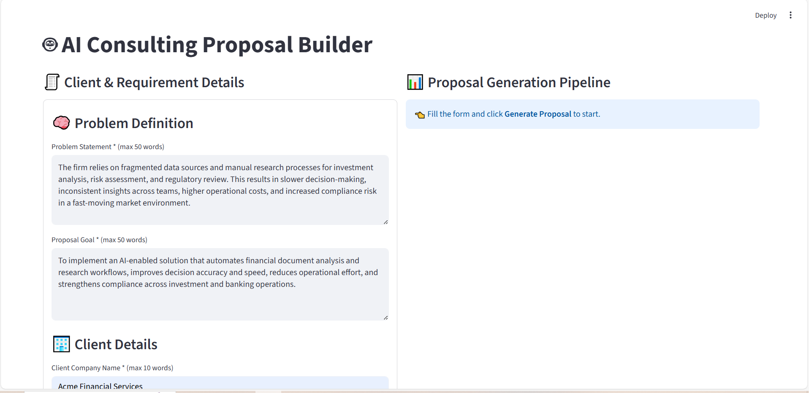
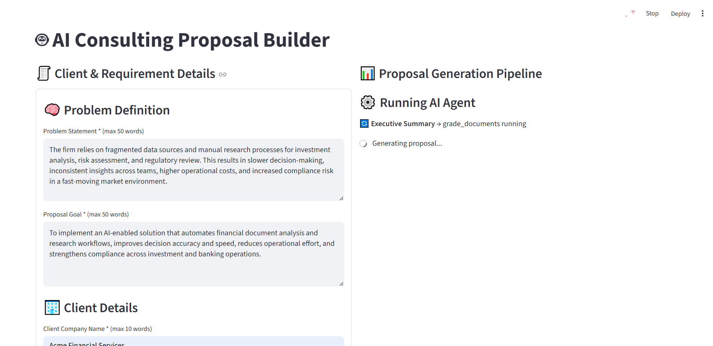
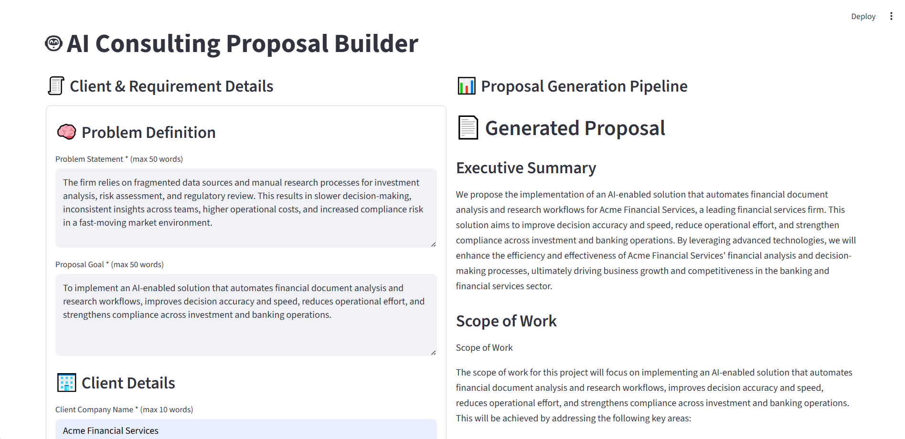

# Hi, I'm Sanchay Kumar 👋

**Senior Software Engineer | Backend & Distributed Systems | AI Agent Enthusiast**

I’m a **Senior Software Engineer** with 5+ years of experience in **backend development, distributed systems, automation, and AI-driven modernization**.  
Passionate about **building intelligent, scalable, and high-performing systems**, with deep expertise in **Python, cloud architectures, and GenAI integration**.

---

## 📝 Summary

- Proven expertise in **Python**, with strong foundations in **DSA, system design, and design patterns**.  
- Experienced in **leading cross-functional teams**, optimizing system performance, and delivering **business-critical solutions**.  
- Skilled in **AI agent applications** and **GenAI-driven automation**, integrating intelligence directly into enterprise workflows.  
- Recognized for **innovation, ownership, and consistent impact** across enterprise and startup environments.

---

## 💡 Technical Skills

- **Languages**: Python, Java, JavaScript  
- **Databases**: MySQL, MongoDB, Redis, PostgreSQL, ChromaDB, FAISS  
- **Frameworks & Libraries**: Flask, Django, Django REST Framework (DRF), Django Channels, Angular, GraphQL  
- **Cloud & DevOps**: AWS, Jenkins, Linux, CI/CD, Microservices Architecture  
- **Testing & QA**: Pytest, Unittest, Automation, Integration, Contract Testing  
- **Data Visualization**: PowerBI  
- **LLM Frameworks**: LangChain, LangGraph  
- **Expertise**: System Design, API Development, Debugging, Agile/Scrum, GenAI Integration  

---

## 🚀 Latest AI Agent Projects

### [AI Consulting & Service Proposal Generator](https://github.com/kumar-sanchay/buisness-proposal)

An **intelligent, agent-driven system** for generating **high-quality consulting and service proposals** aligned with real-world industry standards.  

- Automatically **researches similar proposals, client context, and industry practices**  
- Produces professional, human-like proposals that follow the **correct tone, structure, and expectations**  
- Eliminates manual research, saving time while maintaining **industry authenticity**  

<table>
  <tr>
    <td></td>
    <td></td>
    <td></td>
  </tr>
</table>  

---

## 🌟 Interests

- **AI Agent Applications** & Intelligent Automation  
- Scalable **Backend Systems** & Distributed Architectures  
- **GenAI Integration** for Enterprise Solutions  

---

## 📫 Connect with Me

  
  

---

*“Building intelligent systems that work seamlessly for humans, not just machines.”*
